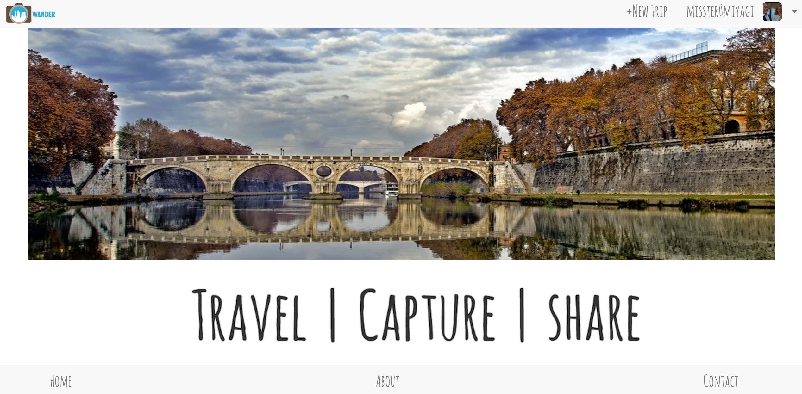

# Technologies Used
- Node.JS
- jQuery
- HTML
- CSS
- Bootstrap

# Project Developers

<a href="https://github.com/kylefberg">Kyle Firstenberg</a>
 
<a href="https://github.com/skempisty">Stephen Kempisty</a>
 
<a href="https://github.com/wjen">Wen Jen</a>
 
<a href="https://github.com/Alex1100">Alex Aleksanyan</a>

Wax on, right hand. Wax off, left hand. Wax on, wax off. Breathe in through nose, out the mouth.Wax on, wax off. Don't forget to breathe, very important.

- Mr. Miyagi

# Intro

Wander was designed by people who have a love for culture and travel.
When you embark on an adventure, you meet incredible people,
see amazing sights, eat great food, and pause where ever you can to
capture that memory with a photo.

Wander will take the photographs of your journey and and map out
where they were taken. Wander will then place them by location over a google
maps image and create a route based on your photos, so you'll know exactly
where the photos were taken and the route you took.

Wander, A new way of capturing your memories and sharing them with the world.

<a href="">Click here to visit the site</a>

# Trello Board
<a href="https://trello.com/b/DqlzFuSI/wander">Trello board</a>

<b>No longer will you forget where you were when you took that amazing shot.</b>

# NEXT STEPS

In our icebox we have several ideas to improve the existing app. Those ideas include:

- 1) Sorting users trips by location

- 2) Chat with other users

- 3) Leave comments of other users trips

- 4) Implement some sort of Heat Map that would show different colors for locations with a greater density of pictures

- 5) Incorporate fusion table queries
